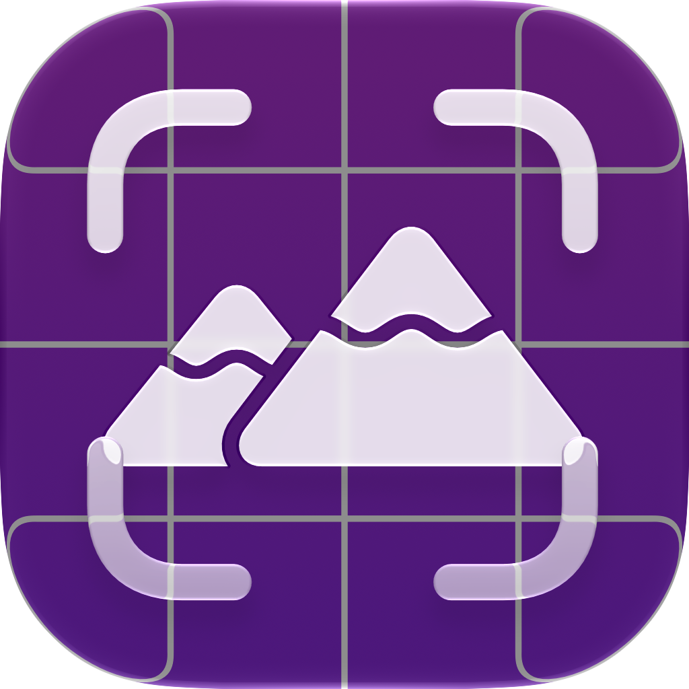

<div align="center">
  <a href="https://github.com/Noah-Johann/WallpaperKit/">
    
  </a>

  <h1 align="center">WallpaperKit</h1>
</div>

## Features

- Easily get the wallpaper for any screen.
- No screen recording or file permissions required.
- Tested on macOS 14 and 27.

## Installation

Use the Swift Package Manager in Xcode to add WidgetKit to your target.
Go to `File` > `Add Package Dependencies...` and paste the project url into the search field.


## Usage

Getting the wallpaper is really easy!
```swift
do {
  try image = WallpaperKit.getWallpaper(screen: NSScreen.main!)
} catch {
  print(error)
}
```
<br/>

## System Requirements
- **macOS 14 Sonoma or later**

## Acknowledgments
Wallpaper capture was based on [this PR](https://github.com/peterp/cmdcmd/pull/22) of [CmdCmd](https://github.com/peterp/cmdcmd/), licensed under [FSL-1.1-MIT](https://github.com/peterp/cmdcmd/blob/main/LICENSE).

## License
WallpaperKit is licensed under the MIT-License. See [`LICENSE`](/LICENSE) for more details.


